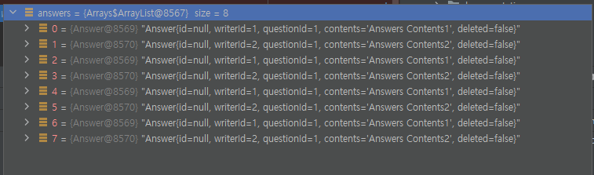
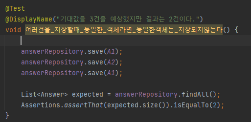

# STEP1. 엔티티 맵핑 

## 요구사항

- QnA 서비스를 만들어가면서 JPA로 실제 도메인 모델을 어떻게 구성하고 객체와 테이블을 어떻게 매핑해야 하는지 알아본다.
- @DataJpaTest를 사용하여 학습 테스트를 해 본다.


### 테이블 구조 
```mysql
create table answer
(
    id          bigint generated by default as identity,
    contents    clob,
    created_at  timestamp not null,
    deleted     boolean   not null,
    question_id bigint,
    updated_at  timestamp,
    writer_id   bigint,
    primary key (id)
)

create table delete_history
(
    id            bigint generated by default as identity,
    content_id    bigint,
    content_type  varchar(255),
    create_date   timestamp,
    deleted_by_id bigint,
    primary key (id)
)

create table question
(
    id         bigint generated by default as identity,
    contents   clob,
    created_at timestamp    not null,
    deleted    boolean      not null,
    title      varchar(100) not null,
    updated_at timestamp,
    writer_id  bigint,
    primary key (id)
)

create table user
(
    id         bigint generated by default as identity,
    created_at timestamp   not null,
    email      varchar(50),
    name       varchar(20) not null,
    password   varchar(20) not null,
    updated_at timestamp,
    user_id    varchar(20) not null,
    primary key (id)
)

alter table user
    add constraint UK_a3imlf41l37utmxiquukk8ajc unique (user_id)

```

## 주요 기능 이해 

|어노테이션|설명|옵션|
|:---:|:---:|:---:|
|@DataJpaTest|엔티티를 테스트|
|@AutoConfigureTestDatabase|내장된 임베디드 데이터베이스|Replace.Any|
|@AutoConfigureTestDatabase|@ActiveProfiles 설정한 환경값에따라 데이터소스가 결정됨|Replace.NONE|
|@ActiveProfiles("...")|액티브 설정|"test","dev"|
|@Size| 저장하기 전에 데이터의 검증 절차를 한번 더 갖기 때문에 더 안전하고 강력한 접근을 한다|

### 힌트 
spring.jpa.properties.hibernate.format_sql=true
spring.jpa.show-sql=true

## 분석
1. Answer
   1. 객체를 생성
      1. 유저가 null인지 확인한다
      2. 유저가 답변을 다는 Question이 존재하는지 확인한다.
   2. 필수 값은 무엇인가?
      1. questionId
      2. writerId
2. Question
   1. 객체를 생성
   2. 기능
      1. writerBy
         1. 유저가 null인지 체크
      2. AddAnswer
3. DeleteHistory
   1. 생성시 현재시간
   2. 수정은 불가능(createDate)
4. User
   1. 기능
      1. update
         1. 아이디와 패스워드가 다른 경우 오류
         2. 이름, 이메일 변경
      2. equalsNameAndEmail
         1. 이름과 이메일이 동일한지 체크
      3. 유저를 게스트로 생성시
         1. 게스트 여부 존재

   
### 무엇을 이해했는가? 

1. Entity는 영속성 컨텍스트에서 보관하고 있다.
2. 트랜잭션이 끝나는 시점에 나간다고 했는데 `save`가 먼저 나간 이유가 무엇인가? 
   1. JPA는 먼저 query를 실행함으로써 IDENTITY를 생성해야하기에 flush 단계에 다가지 않고 먼저 나가게 된다.

3. 왜 조회가 먼저가 되었는가? 
   1. `merge`작업을 하기위해서 내가 존재하는 녀석인지 확인하기 위해서 작동했다.
    
4. flush 무엇인가? 
   1. 이때 쓰기 지연 저장소에 쌓아 놨던 INSERT, UPDATE, DELETE SQL들이 DB에 날라간다
      주의! 영속성 컨텍스트를 비우는 것이 아니다.


5. 동일한 객체를 컬렉션에담는경우 JPA는 모두 대상건을 저장한다.



6. 동일한 객체를 저장하는경우 JPA는 동일한 객체인경우 저장하지 않는다.



7. [JPA: @DataJpaTest 에서 트랜잭션 Rollback 이 안된 이유는?](출처: https://namocom.tistory.com/995)


[8. @GeneratedValue의 전략시](##무엇이문제였는가?)

|생성 전략|설명|
|:---:|:---:|
|GenerationType.IDENTITY|데이터베이스에 키 생성방법을 위임|
|GenerationType.AUTO|각 데이터베이스 방언에 따라 자동으로 지정(기본 값)|
|GenerationType.TABLE|
|GenerationType.SEQUENCE|	데이터베이스의 시퀸스를 이용해서 키 값을 생성|


## 무엇이문제였는가?

1. 트랜잭션 단위는 끝났지만 AutoIncrement 계속증가했다. 문제를 해결하기  `auto-increment 값을 재지정해주면 된다.`
```java
 @After
 public void teardown() {
     this.레파지토리.deleteAll();
     this.entityManagr
         .createNativeQuery("ALTER TABLE 테이블명 ALTER COLUMN `pofo_post_no` RESTART WITH 1")
         .executeUpdate();
 }
```
- 이 방법은 @DataJpaTest @Transactional이 적용되는 서비스 클래스를 테스트 할 때는 적용 가능하지만,
- @SpringBootTest( webEnvironment = SpringBootTest.WebEnvironment.RANDOM_PORT )를 사용하는 환경에서는 사용 할 수 없다.
- 데이터의 존재유무에 대한 검증방식으로 해결할 수 있다.

2. `객체`에 ID값을 넣었다고 해서 저장시 해당번호로 저장되지 않는다.
   - 넣은 값을 실행하고 싶다면 `GeneratedValue` 삭제
   - 이유는 아래의 전략에 따라서 @Id 값을 할당한다.
   

# Step2. 연관관계 맵핑 

## 1. CaseCadeType
|type|설명|
|:---:|:---:|
|ALL|상위 엔터티에서 하위 엔터티로 모든 작업을 전파|
|PERSIST|하위 엔티티까지 영속성 전달(설정된 곳에서 저장이 일어나면 하위엔티티까지 저장)|
|MERGE|하위 엔티티까지 병합 작업을 지속(테이블을 조회후 업데이트)|
|REMOVE|하위 엔티티까지 제거 작업을 지속|
|REFRESH|데이터베이스로부터 인스턴스 값을 다시 읽어 오기(새로고침)
|DETACH|영속성 컨텍스트에서 엔티티 제거|


## 1. 무엇인 문제였는가?

1. 처음 `AnswerRepositoryTest`에 2가지의 테스트 케이스를 작성했다.
2. 아래 테스트케이스를 보면 정상적으로 작동할 것 같지만 `전체테스트`와`개별로 테스트`했을 때의 결과 값이 달랐다 .
3. `여러건을_저장할때_동일한_객체라면_동일한객체는_변경이_없다면_INSERT되지_않는다` 함수에서 
   - 단위로 테스트시 2건, 전체로 테스트시 3건이이었다.
```java
public class AnswerRepositoryTest {

   @Autowired
   AnswerRepository answerRepository;

   @Autowired
   QuestionRepository questionRepository;

   @Autowired
   UserRepository userRepository;
	
   @BeforeEach
   void setUp {
      userRepository.save(JAVAJIGI);
      userRepository.save(SANJIGI);
      questionRepository.save(asList(Q1,Q2));
   }
   
   @Test
   @DisplayName("기대값을 3건을 예상했지만 결과는 2건이다.")
   void 여러건을_저장할때_동일한_객체라면_동일한객체는_변경이_없다면_INSERT되지_않는다() {

      answerRepository.save(A1);
      answerRepository.save(A2);
      answerRepository.save(A1);

      List<Answer> expected = answerRepository.findAll();
      Assertions.assertThat(expected.size()).isEqualTo(2);
   }
	
}
```

## 원인은 무엇인가?
### 전체 테스트 테스트케이스가 하나만 존재하는 경우
```java
   
   public class AnswerRepositoryTest {
      @Test
      @DisplayName("기대값을 3건을 예상했지만 결과는 2건이다.")
      void 여러건을_저장할때_동일한_객체라면_동일한객체는_변경이_없다면_INSERT되지_않는다() {
      
         answerRepository.save(A1);
         answerRepository.save(A2);
         answerRepository.save(A1);
      
         List<Answer> expected = answerRepository.findAll();
         Assertions.assertThat(expected.size()).isEqualTo(2);
      }
   }
```

아래와 같이 두객체는 공유하고 있습니다. 


### 전체테스트 케이스가 두개가 있는경우 

```java

public class AnswerRepositoryTest {
     @Test
     void 입력된정보와_저장된정보가_동일한가() {

        // when
        answerRepository.save(A1);
     }
	
	
     @Test
     @DisplayName("기대값을 3건을 예상했지만 결과는 2건이다.")
     void 여러건을_저장할때_동일한_객체라면_동일한객체는_변경이_없다면_INSERT되지_않는다() {

         answerRepository.save(A1);
         answerRepository.save(A2);
         answerRepository.save(A1);
         
         List<Answer> expected = answerRepository.findAll();
         Assertions.assertThat(expected.size()).isEqualTo(2);
   }
}
```

아래와 같이 두 클래스는 각자의 해쉬코드를 가지게 됩니다.


#### 해결방법은 무엇인가? 
- 처음 한개를 가지고 테스틑 했을 때는 두 객체간의 관계는 같은 주소값을 바라보고 있었습니다.
- 하지만 `answerRepository.save(A1);`를 하기 위한 테스트 케이스를 하나 더 추가하면서 각자만의 주소값을 가지게 되었습니다.
- 아직은 해결하지 못함 ..


### 2. Answer는 영속성 컨텍스트가 되지 않았는데 왜 저장이 되는가? 
   - `new Answer`는 영속성 컨텍스트화 되지 않은 상태인데 어떻게 해서 저장이 되는가
```java
    User javajigi = userRepository.save(JAVAJIGI);
    Question question = new Question(null, "title1", "contents1").writeBy(javajigi);
    question.addAnswer(new Answer(null, javajigi, question, "Answers Contents1"));
    questions = questionRepository.saveAll(asList(question));
```
   - `new Answer`는 `caseCade`를 통해 저장이 되는 방식이다. 
   - 기존에 `caseCade`를 설정하지 않아 `new Answer`가 저장되기를 바랬지만, 실제 DB에는 저장되지 않았다.
   -  아래와 같이 `caseCade를 설정후 해당 값을 넣어주면 AnswerRepository를 사용 하지 않아도 아래의 엔티티까지 저장`된다.
```java

    @OneToMany(mappedBy = "question", cascade = ALL)
    private List<Answer> answers = new ArrayList();

    public void addAnswer(Answer answer) {
        answer.toQuestion(this);
        answers.add(answer);
    }
```

