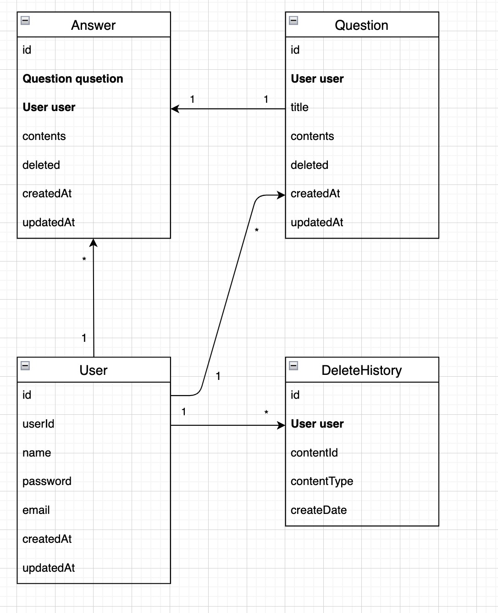
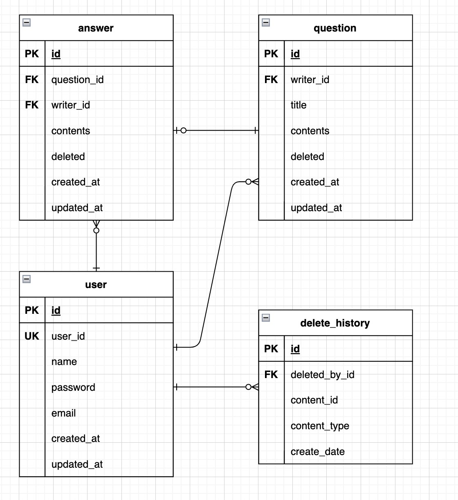

# 🚀 1단계 - 엔티티 매핑

## 요구 사항
QnA 서비스를 만들어가면서 JPA로 실제 도메인 모델을 어떻게 구성하고 객체와 테이블을 어떻게 매핑해야 하는지 알아본다.
- 아래의 DDL(Data Definition Language)을 보고 유추하여 엔티티 클래스와 리포지토리 클래스를 작성해 본다.
- @DataJpaTest를 사용하여 학습 테스트를 해 본다.

```sql
create table answer
(
    id          bigint generated by default as identity,
    contents    clob,
    created_at  timestamp not null,
    deleted     boolean   not null,
    question_id bigint,
    updated_at  timestamp,
    writer_id   bigint,
    primary key (id)
)
```

```sql
create table delete_history
(
    id            bigint generated by default as identity,
    content_id    bigint,
    content_type  varchar(255),
    create_date   timestamp,
    deleted_by_id bigint,
    primary key (id)
)
```

```sql
create table question
(
    id         bigint generated by default as identity,
    contents   clob,
    created_at timestamp    not null,
    deleted    boolean      not null,
    title      varchar(100) not null,
    updated_at timestamp,
    writer_id  bigint,
    primary key (id)
)
```

```sql
create table user
(
    id         bigint generated by default as identity,
    created_at timestamp   not null,
    email      varchar(50),
    name       varchar(20) not null,
    password   varchar(20) not null,
    updated_at timestamp,
    user_id    varchar(20) not null,
    primary key (id)
)

alter table user
    add constraint UK_a3imlf41l37utmxiquukk8ajc unique (user_id)
```

### 📚 TODO LIST 📚
- **공통 엔티티 분리**
  - [x] createdAt, updatedAt을 가지고 있는 Entity 작성
- **answer 테이블**
  - [x] Entity 매핑
    - id : GenerateType.IDENTITY
    - created_by : NOT NULL
    - deleted : NOT NULL
  - [x] `@DataJpaTest` 사용하여 테스트 코드 작성
- **delete_history 테이블**
  - [x] Entity 매핑
    - id : GenerateType.IDENTITY
  - [x] `@DataJpaTest` 사용하여 테스트 코드 작성
- **question 테이블**
  - [x] Entity 매핑
    - id : GenerateType.IDENTITY
    - created_by : NOT NULL
    - deleted : NOT NULL
    - title : NOT NULL
  - [x] `@DataJpaTest` 사용하여 테스트 코드 작성
- **user 테이블**
  - [x] Entity 매핑
    - id : GenerateType.IDENTITY
    - name : NOT NULL
    - password : NOT NULL
    - user_id : NOT NULL, UNIQUE
  - [x] `@DataJpaTest` 사용하여 테스트 코드 작성

  
---
# 🚀 2단계 - 연관 관계 매핑

## 요구사항
QnA 서비스를 만들어가면서 JPA로 실제 도메인 모델을 어떻게 구성하고 객체와 테이블을 어떻게 매핑해야 하는지 알아본다.
- 객체의 참조와 테이블의 외래 키를 매핑해서 객체에서는 참조를 사용하고 테이블에서는 외래 키를 사용할 수 있도록 한다.

## 힌트
```sql
alter table answer
    add constraint fk_answer_to_question
        foreign key (question_id)
            references question

alter table answer
    add constraint fk_answer_writer
        foreign key (writer_id)
            references user

alter table delete_history
    add constraint fk_delete_history_to_user
        foreign key (deleted_by_id)
            references user

alter table question
    add constraint fk_question_writer
        foreign key (writer_id)
            references user
```

### 📚 TODO LIST 📚
- 객체와 테이블 매핑 관계
  - [x] 객체, 테이블 매핑 관계 구조 파악
    - 객체 관계 구조
      
    - 테이블 관계 구조
      
- **answer 테이블**
  - [x] Entity 수정
  - [ ] 테스트 코드 추가
- **delete_history 테이블**
  - [x] Entity 수정
  - [x] 테스트 코드 추가
- **question 테이블**
  - [x] Entity 수정
  - [ ] 테스트 코드 추가
- **user 테이블**
  - [x] Entity 수정
  - [x] ~~테스트 코드 추가~~


---
# 🚀 3단계 - 질문 삭제하기 리팩터링

## 요구사항

### 📚 TODO LIST 📚

---
