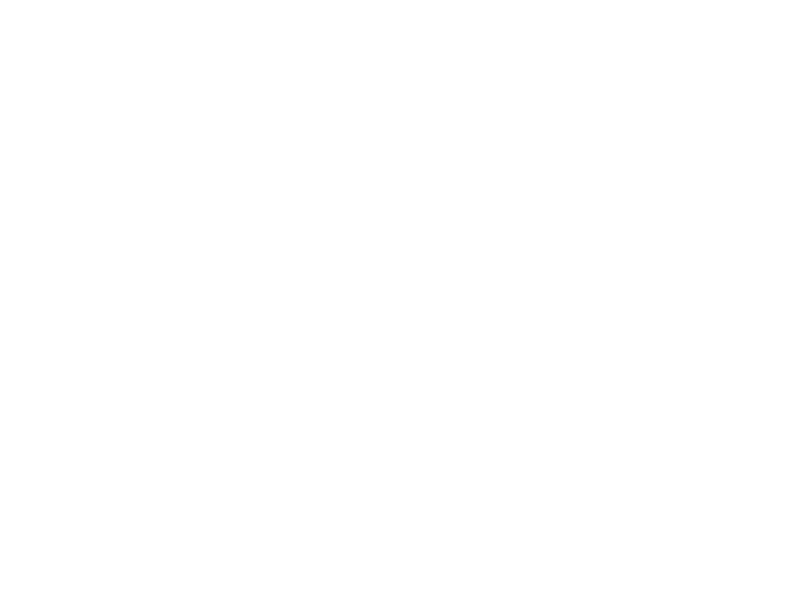

# JPA
> 객체지향프로그래밍과 관계형 데이터베이스는 근본적으로 괴리가 존재한다.  
> JPA는 객체지향을 좀 더 객체지향답게 사용하기 위한 기술로서, 데이터베이스에 의존적이지 않은 객체설계가 가능하게 만들어 준다.

## 1단계 - 엔티티 매핑
- QnA 서비스를 만들어가면서 JPA로 실제 도메인 모델을 어떻게 구성하고 객체와 테이블을 어떻게 매핑해야 하는지 알아본다.
- `DDL`을 보고 유추하여 엔티티 클래스와 리포지토리 클래스를 작성해 본다.
- `@DataJpaTest`를 사용하여 `학습 테스트`를 해 본다.

### Entity
- User
  - [x] User 엔티티 매핑
  - [x] UserRepository 저장 및 find
- Question
  - [x] Question 엔티티 매핑
  - [x] QuestionRepository 저장 및 find
- Answer
  - [x] Answer 엔티티 매핑
  - [x] AnswerRepository 저장 및 find
- DeleteHistory
  - [x] DeleteHistory 엔티티 매핑

### 1단계 피드백
- [x] @Embeddable 타입을 @MappedSuperclass로 정의

## 2단계 - 연관 관계 매핑
> 1단계에서 매핑된 객체들은 뭔가 이상(?)하다. 객체지향적인 설계라면, 객체의 `참조`를 사용해 객체 그래프를 `탐색`해야 하지만,  
> DBMS의 설계대로 `외래 키`를 가지고 있다.  
>   
> 각 객체의 역할에 맞게 객체 사이의 연관 관계를 매핑해야 한다.
> ```java
> // 테이블 설계대로 맞추었을 경우 객체 탐색
> Question question = findQuestionById(questionId);
> List<Answer> answers = answerRepository.findByQuestionIdAndDeletedFalse(questionId);
> 
> // 객체지향답게 설계했을 경우 객체의 참조를 사용해 탐색
> Question question = findQuestionById(questionId);
> List<Answer> answers = question.getAnswers();
> ```
```sql
-- DDL 힌트
alter table answer
  add constraint fk_answer_to_question
    foreign key (question_id)
      references question

alter table answer
  add constraint fk_answer_writer
    foreign key (writer_id)
      references user

alter table delete_history
  add constraint fk_delete_history_to_user
    foreign key (deleted_by_id)
      references user

alter table question
  add constraint fk_question_writer
    foreign key (writer_id)
      references user
```

### 2단계 피드백
- [x] FetchType.LAZY 에 고민해 볼 것
- [x] 연관관계 편의 메서드 적용해 볼 것

## 3단계 - 질문 삭제하기 리팩터링
> QnA 서비스를 만들어가면서 JPA로 실제 도메인 모델을 어떻게 구성하고 객체와 테이블을 어떻게 매핑해야 하는지 알아본다

### 연관 관계 매핑 수정

**_User : DeleteHistory = 1 : 1 --> User : DeleteHistory = 1 : * 로 변경했습니다._** 
- [x] User : Question = 1 : *
- [x] User : Answer = 1 : *
- [x] User : DeleteHistory = 1 : *
- [x] Question : Answer = 1 : *

### 프로그래밍 요구사항
- `qna.service.QnaService.deleteQuestion()`의 메서드에서 비즈니스 로직을 도메인으로 분리
  - 도메인의 단위 테스트 작성
- 리팩터링 이후 `qna.service.QnaServiceTest`의 모든 테스트가 통과해야 함
- 객체지향 생활 체조 원칙을 지킬 것
  - **_일급 컬렉션을 사용_**
  - **_모든 엔티티를 작게 유지_**
  - **_3개 이상의 인스턴스 변수를 가진 클래스를 쓰지 않는다_**

### 기능 요구사항
- 질문 데이터를 완전히 삭제하는 것이 아니라 데이터의 상태를 삭제 상태(deleted - boolean type)로 변경한다.
  - 질문 / 답변 공통
- `로그인 사용자와 질문한 사람이 같은 경우` 삭제할 수 있다
  - 질문 / 답변 공통
- 답변이 없는 경우 삭제가 가능하다.
  - 질문의 삭제 가능 조건 1
- 질문자와 답변 글의 모든 답변자가 같은 경우 삭제가 가능하다.
  - 질문을 삭제하는 경우 답변에 대한 상태 체크 후 삭제 가능 조건 2
- 질문을 삭제할 때 답변 또한 삭제해야 하며, 답변의 상태 또한 삭제 상태(deleted)로 변경한다.
  - 질문을 삭제할 때 답변도 삭제가 가능한 상태라면, 답변을 삭제 상태로 변경 후 질문 삭제
- 질문자와 답변자가 다른 경우 답변을 삭제할 수 없다.
  - 답변의 작성자가 삭제 한 후 질문을 삭제가능
- 질문과 답변 삭제 이력에 대한 정보를 DeleteHistory를 활용해 남긴다
  - DeleteHistory insert 조건

### Domain 구현 기능 목록

#### Question
- [x] 삭제 시 deleted 값 삭제 상태로 변경
- [x] 삭제 시 writer가 로그인 사용자와 같은 지 검증로직
- [x] List<Answer> answers 를 일급 컬렉션으로 정의
- [x] 답변이 없는 경우만 삭제 ; 답변이 모두 삭제된 상태
- [x] 삭제 후 deletehistory에 삭제된 데이터가 존재해야 함

#### Answer
- [x] 삭제 시 deleted 값 삭제 상태로 변경
- [x] 삭제 시 writer가 로그인 사용자와 같은 지 검증로직
- [x] 삭제 후 deletehistory에 삭제된 데이터가 존재해야 함

#### DeleteHistory
- [x] 삭제 될 때 데이터와 삭제한 사람의 정보를 저장

#### DeleteHistories
- [x] DeleteHistory의 일급 컬렉션 생성

#### Content
- [x] Question과 Answer의 공통 부분...

### 3단계 피드백
- [x] BaseContentEntity 에 대한 과도한 책임 부여 --> Content에 집중된 책임과 역할에 대해 생각해 볼 것
  - **_BaseContenctEntity MappedSuperclass 삭제_**
    - 단일 책임의 원칙에 따르면 BaseContentEntity는 Content와 관련된 역할만 수행해야 한다.  
      하지만, **_Content만 별도 Entity로 구성하는 것은 현재 구조상 별 의미가 없다고 판단됨.._**
    - `id`, `writer`, `deleted`는 공통된 속성이면서도, `Question`과 `Answer` 객체에선 각자의 역할에서  
      다르게 확장될 수 있는 가능성이 높은 속성이다. 따라서 각자 가지고 있는 것이 역할과 책임의 측면에서 바람직하다고 판단됨
- [x] 일급컬렉션의 getter는 values 라는 네이밍이 어울린다..!
- [x] 생성자에서 validate외 다른 로직은 없는 것이 좋다는 의견에 대한 고민
- [x] 주석 코드나 사용되지 않는 코드는 삭제
- [ ] Question.addAnswer에서 ```answer.toQuestion(this)``` 부분이 필요한 지 재검토
- [x] 개체 비교하는 패턴 적용(isSame(), assertTrue 사용 권장)