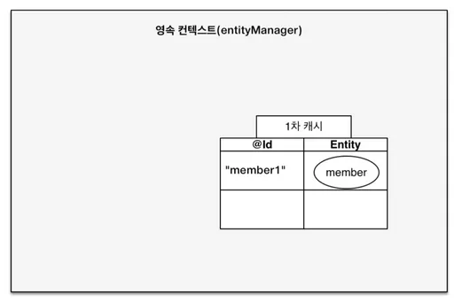
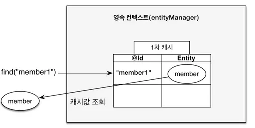
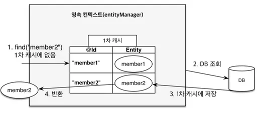
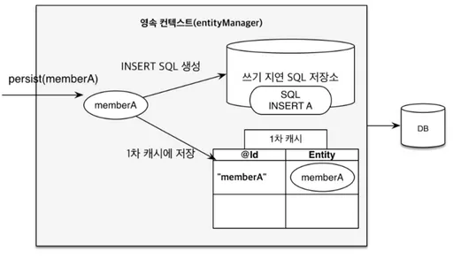
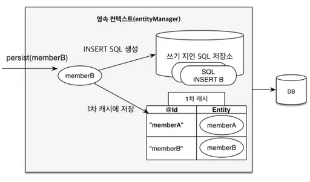
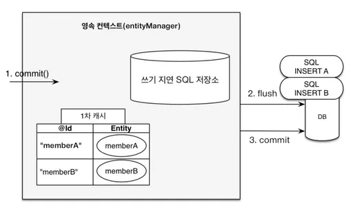
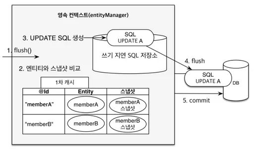

### JPA 실습 1

들어가기 전에

Spring Data JDBC
- If you load an entity, SQL statements get executed. Once this is done, you have a completely loaded entity. No lazy loading or caching is done.
- If you save an entity, it gets saved. If you do not, it does not. There is no dirty tracking and no session.
- There is a simple model of how to map entities to tables. It probably only works for rather simple cases. If you do not like that, you should code your own strategy. Spring Data JDBC offers only very limited support for customizing the strategy with annotations.

학습 로드맵
- [토크ON 41차. JPA 프로그래밍 기본기 다지기 | T아카데미](https://www.youtube.com/playlist?list=PL9mhQYIlKEhfpMVndI23RwWTL9-VL-B7U)
- [자바 ORM 표준 JPA 프로그래밍 (김영한 저 | 에이콘출판사)](http://www.yes24.com/product/goods/19040233)
- [인프런 - 김영한](https://www.inflearn.com/courses?s=%EA%B9%80%EC%98%81%ED%95%9C)
- [영속성 컨텍스트로 보는 JPA](https://www.slideshare.net/ssusere4d67c/jpa-56081624)

---

### 1. In the Beginning

객체 지향 패러다임
- 시스템을 구성하는 객체들에게 적절한 책임을 할당하는 것
- 상속
- 연관 관계
  - 객체의 연관관계에는 방향성이 있다.
  - 테이블의 연관관계는 방향성이 없다.
- 객체는 자유롭게 객체 그래프를 탐색할 수 있어야 한다.
```
class Line {
    Long id;
    String name;
    Set<LineStation> stations;
}

class LineStation {
    Station preStation;
    Station station;
}

class Station {
    Long id;
    String name;
}
```

SQL을 직접 다룰 때 발생하는 문제점

반복 작업
- 새로운 필드가 추가되면 관련된 SQL을 다 수정해야 한다.
```
INSERT INTO station(`id`, `name`) VALUES ...
SELECT `id`, `name` FROM station
UPDATE station SET ...
```

신뢰성
- 개발자들이 엔티티를 신뢰하고 사용할 수 없다.
```
class LineService {
    private LineRepository lines;
    
    public class LineService(LineRepository lines) {
        this.lines = lines;
    }
    
    public void findLineWithStationsById(Long id) {
        Line line = lines.findById(id);
        line.getLineStation()
                .stream()
                .map(LineStation::getStation)
                .collect(Collectors.toList()); // ?
    }
}
```

---

### 2. JPA

ORM
- [[10분 테코톡] 🧘‍♂️코즈의 JDBC, SQLMAPPER, ORM](https://www.youtube.com/watch?v=mezbxKGu68Y)

데이터베이스 스키마 자동 생성
- JPA는 데이터베이스 스키마를 자동으로 생성하는 기능을 지원한다.
- 아래 속성을 추가하면 애플리케이션 실행 시점에 데이터베이스 테이블을 자동으로 생성한다.
  - spring.jpa.hibernate.ddl-auto=create
    - create: 기존 테이블 삭제 후 다시 생성 (DROP + CREATE)
    - create-drop: create와 같으나 종료시점에 테이블 DROP
    - update: 변경된 부분만 반영 (운영 DB에 사용하면 안됌)
    - validate: entity와 table이 정상 매핑되었는지만 확인
    - none: 사용하지 않음

```
@Entity // (1)
@Table(name = "station") // (2) 
public class Station {
    @Id // (3)
    @GeneratedValue(strategy = GenerationType.IDENTITY) // (4)
    private Long id;

    @Column(name = "name", nullable = false) // (5)
    private String name;
    
    protected Station() { (6)
    }
}
```
(1) @Entity
- 엔티티 클래스임을 지정하며 테이블과 매핑된다.

(2) @Table
- 엔티티가 매핑될 테이블을 지정하고 생략 시 엔티티 클래스 이름과 같은 테이블로 매핑된다.
- 굳이 선언하지 않아도 된다.

(3) @Id
- 직접 매핑해서 사용하는 경우

(4) @GeneratedValue
- PK의 생성 규칙을 나타낸다.

(5) @Column
- 컬럼의 이름을 이용하여 지정된 필드나 속성을 테이블의 컬럼에 매핑한다.
- 굳이 선언하지 않아도 된다.

(6) 매개 변수가 없는 생성자
- The entity class must have a no-arg constructor. The entity class may have other constructors as well. - JSR 338

### 실습
- spring.jpa.properties.hibernate.format_sql=true와 spring.jpa.show-sql=true를 추가하여 콘솔에 실행되는 테이블 생성 DDL을 출력해 보자.
```
create table station (
    id bigint generated by default as identity,
    name varchar(255) not null,
    primary key (id)
)
```

Spring Data JPA를 쓰기 전
- 또다시 반복 작업
```
class StationRepository {
    void save(Station station) {...}
    Station findById(Long id) {...}
    List<Station> findAll() {...}
    Station findByName(String name) {...}
}
```

Spring Data JPA
- 메서드 이름으로 쿼리 생성
  - [Appendix C: Repository query keywords](https://docs.spring.io/spring-data/jpa/docs/current/reference/html/#repository-query-keywords)
```
interface StationRepository extends JpaRepository<Station, Long> {
    Station findByName(String name);
}
```

### 실습
- save()와 findByName()에 대한 테스트를 해 보자.
```
@DataJpaTest
class StationRepositoryTest {
    @Autowired
    private StationRepository stations;
    
    @Test
    void save() {
        Station expected = new Station("잠실역");
        Station actual = stations.save(expected);
        assertAll(
                () -> assertThat(actual.getId()).isNotNull(),
                () -> assertThat(actual.getName()).isEqualTo(expected.getName())
        );
    }

    @Test
    void findByName() {
        String expected = "잠실역";
        stations.save(new Station(expected));
        String actual = stations.findByName(expected).getName();
        assertThat(actual).isEqualTo(expected);
    }
}
```

---

### 3. 영속성 컨텍스트
- 엔티티를 영구 저장하는 환경
- 엔티티 매니저로 엔티티를 저장하거나 조회하면 엔티티 매니저는 영속성 컨텍스트에 엔티티를 보관하고 관리한다.
```
- 1차 캐시
- 동일성 보장
- 트랜잭션을 지원하는 쓰기 지연
- 변경 감지
- 지연 로딩
```

### 실습
- 동일성 보장 맛보기
```
@Test
void identity() {
    Station station1 = stations.save(new Station("잠실역"));
    Station station2 = stations.findById(station1.getId()).get();
    assertThat(station1 == station2).isTrue();
}
```




### 실습
- 엔티티를 영속성 컨텍스트에 등록 해 보자.
```
@Test
void register() {
    Station actual = stations.save(new Station(1L, "잠실역")); 
    assertThat(actual.getId()).isNotNull();
    assertThat(actual.getName()).isEqualTo("잠실역");
    // stations.flush();
}

@Entity
public class Station implements Persistable<Long> {  
    @Id
    @Column(name = "id")
    // @GeneratedValue(strategy = GenerationType.IDENTITY)
    private Long id;
    
    public Station(Long id, String name) {
        this.id = id;
        this.name = name;
    }
  
    @Override
    public boolean isNew() {
        return true;
    }
    
    ...
}

@Repository
@Transactional(readOnly = true)
public class SimpleJpaRepository<T, ID> implements JpaRepositoryImplementation<T, ID> {

    @Transactional
    @Override
    public <S extends T> S save(S entity) {
        Assert.notNull(entity, "Entity must not be null.");
  
        if (entityInformation.isNew(entity)) {
            em.persist(entity);
            return entity;
        } else {
            return em.merge(entity);
        }
    }
    
    ...
}

public class JpaPersistableEntityInformation<T extends Persistable<ID>, ID>
		extends JpaMetamodelEntityInformation<T, ID> {

    @Override
    public boolean isNew(T entity) {
        return entity.isNew();
    }
  
  ...
}
```

엔티티의 생명주기
- 비영속(new/transient): 영속성 컨텍스트와 전혀 관계가 없는 상태
- 영속(managed): 영속성 컨텍스트에 저장된 상태
- 준영속(detached): 영속성 컨텍스트에 저장되었다가 분리된 상태
- 삭제(removed): 삭제된 상태


@Transactional
- 트랜잭션을 커밋하는 순간 영속성 컨텍스트를 데이터베이스에 반영





### 실습
- 변경 감지 맛보기
```
@Test
void update() {
    Station station1 = stations.save(new Station("잠실역"));
    station1.changeName("몽촌토성역");
    Station station2 = stations.findByName("몽촌토성역");
    assertThat(station2).isNotNull();
}
```


