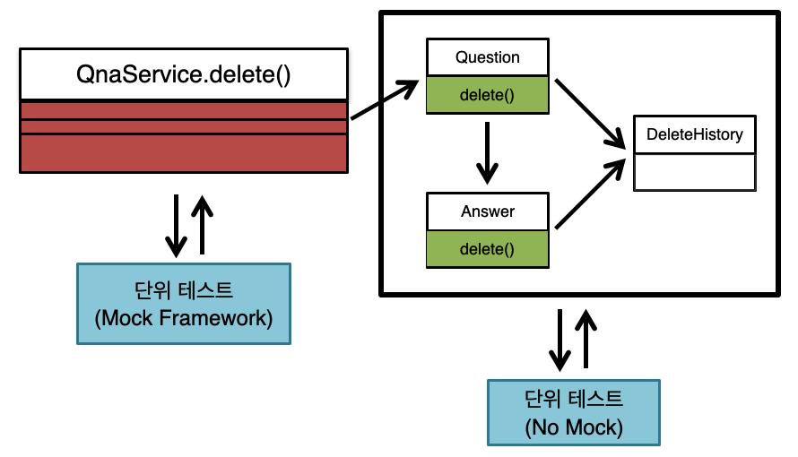

### JPA

미션 설명
```
JPA 엔티티와 영속성, 연관 관계와 같은 핵심 개념을 학습한다.

도메인 변경을 최소화하면서 QnA 서비스를 리팩토링한다.
```

미션에 들어가기에 앞서 [토크ON 41차. JPA 프로그래밍 기본기 다지기](https://www.youtube.com/playlist?list=PL9mhQYIlKEhfpMVndI23RwWTL9-VL-B7U) 강의를 참고한다. 

---

### 1. 엔티티 매핑
요구 사항
- 도메인 모델링 후 엔티티와 테이블을 매핑해본다.
  - 주어진 DDL을 보고 엔티티와 리포지토리 클래스를 작성한다.
  - @DataJpaTest를 사용하여 데이터베이스 스키마가 생성되는지 확인한다.

Data Definition Language
```
-- H2
create table answer
(
    id          bigint generated by default as identity,
    contents    clob,
    created_at  timestamp not null,
    deleted     boolean   not null,
    question_id bigint,
    updated_at  timestamp,
    writer_id   bigint,
    primary key (id)
)

create table delete_history
(
    id            bigint generated by default as identity,
    content_id    bigint,
    content_type  varchar(255),
    create_date   timestamp,
    deleted_by_id bigint,
    primary key (id)
)

create table question
(
    id         bigint generated by default as identity,
    contents   clob,
    created_at timestamp    not null,
    deleted    boolean      not null,
    title      varchar(100) not null,
    updated_at timestamp,
    writer_id  bigint,
    primary key (id)
)

create table user
(
    id         bigint generated by default as identity,
    created_at timestamp   not null,
    email      varchar(50),
    name       varchar(20) not null,
    password   varchar(20) not null,
    updated_at timestamp,
    user_id    varchar(20) not null,
    primary key (id)
)

alter table user
    add constraint UK_a3imlf41l37utmxiquukk8ajc unique (user_id)
    
-- MySQL
create table answer
(
    id          bigint not null auto_increment,
    contents    longtext,
    created_at  datetime(6) not null,
    deleted     bit    not null,
    question_id bigint,
    updated_at  datetime(6),
    writer_id   bigint,
    primary key (id)
) engine=InnoDB

create table delete_history
(
    id            bigint not null auto_increment,
    content_id    bigint,
    content_type  varchar(255),
    create_date   datetime(6),
    deleted_by_id bigint,
    primary key (id)
) engine=InnoDB

create table question
(
    id         bigint       not null auto_increment,
    contents   longtext,
    created_at datetime(6)  not null,
    deleted    bit          not null,
    title      varchar(100) not null,
    updated_at datetime(6),
    writer_id  bigint,
    primary key (id)
) engine=InnoDB

create table user
(
    id         bigint      not null auto_increment,
    created_at datetime(6) not null,
    email      varchar(50),
    name       varchar(20) not null,
    password   varchar(20) not null,
    updated_at datetime(6),
    user_id    varchar(20) not null,
    primary key (id)
) engine=InnoDB

alter table user
    add constraint UK_a3imlf41l37utmxiquukk8ajc unique (user_id)
```

---

### 2. 연관 관계 매핑
요구 사항
- 도메인 모델링 후 엔티티와 테이블을 매핑해본다.
  - 연관 관계 개념에 대해 학습한다.
    - 객체는 참조를 사용해서, 테이블은 외래 키를 사용해서 관계를 맺는다.
  - 주어진 DDL을 보고 엔티티와 리포지토리 클래스를 수정한다.

이전 단계에서 엔티티 설계가 이상하다는 생각이 들었다면 객체 지향 설계를 의식하는 개발자고, 그렇지 않고 자연스러웠다면 데이터 중심의 개발자일 것이다. 객체 지향 설계는 각각의 객체가 맡은 역할과 책임이 있고 관련 있는 객체끼리 참조하도록 설계해야 한다.

```
Question question = findQuestionById(questionId);
List<Answer> answers = answerRepository.findByQuestionIdAndDeletedFalse(questionId);
```

위 방식은 객체 설계를 테이블 설계에 맞춘 방법이다. 특히 테이블의 외래 키를 객체에 그대로 가져온 부분이 문제다. 왜냐하면 관계형 데이터베이스는 연관된 객체를 찾을 때 외래 키를 사용해서 조인하면 되지만 객체에는 조인이라는 기능이 없다. 객체는 연관된 객체를 찾을 때 참조를 사용해야 한다.

```
Question question = findQuestionById(questionId);
List<Answer> answers = question.getAnswers();
```

아래의 DDL을 보고 유추한다.

Data Definition Language

```
-- H2
alter table answer
    add constraint fk_answer_to_question
        foreign key (question_id)
            references question (id)

alter table answer
    add constraint fk_answer_writer
        foreign key (writer_id)
            references user (id)

alter table delete_history
    add constraint fk_delete_history_to_user
        foreign key (deleted_by_id)
            references user (id)

alter table question
    add constraint fk_question_writer
        foreign key (writer_id)
            references user (id)

-- MySQL
alter table answer
    add constraint fk_answer_to_question
        foreign key (question_id)
            references question (id)

alter table answer
    add constraint fk_answer_writer
        foreign key (writer_id)
            references user (id)

alter table delete_history
    add constraint fk_delete_history_to_user
        foreign key (deleted_by_id)
            references user (id)

alter table question
    add constraint fk_question_writer
        foreign key (writer_id)
            references user (id)
```

---

### 3. 질문 삭제하기 리팩터링
기능 요구사항
- 데이터를 완전히 삭제하는 것이 아니라 데이터의 상태를 삭제 상태로 변경한다.
- 로그인 사용자와 질문한 사람이 같은 경우 삭제할 수 있다.
- 답변이 없는 경우 삭제할 수 있다.
- 질문자와 모든 답변자가 같은 경우 삭제할 수 있다.
- 질문자와 답변자가 다른 경우 답변을 삭제할 수 없다.
- 질문을 삭제할 때 답변 또한 삭제해야 하며 답변 또한 삭제 상태로 변경한다.
- 질문과 답변 삭제 이력에 대한 정보를 남긴다.

프로그래밍 요구 사항
- 질문 삭제 기능을 구현한 메서드는 단위 테스트하기 어려운 코드와 그렇지 않은 코드가 섞여 있다.
- 단위 테스트 가능한 코드를 분리하고 테스트를 구현한다. 단, 리팩토링 후에도 QnA 서비스의 모든 테스트는 통과해야 한다.
```
@Transactional
public void deleteQuestion(User loginUser, Long questionId) throws CannotDeleteException {
    Question question = findQuestionById(questionId);
    if (!question.isOwner(loginUser)) {
        throw new CannotDeleteException("질문을 삭제할 권한이 없습니다.");
    }

    List<Answer> answers = question.getAnswers();
    for (Answer answer : answers) {
        if (!answer.isOwner(loginUser)) {
            throw new CannotDeleteException("다른 사람이 쓴 답변이 있어 삭제할 수 없습니다.");
        }
    }

    List<DeleteHistory> deleteHistories = new ArrayList<>();
    question.setDeleted(true);
    deleteHistories.add(new DeleteHistory(ContentType.QUESTION, questionId, question.getWriterId(), LocalDateTime.now()));
    for (Answer answer : answers) {
        answer.setDeleted(true);
        deleteHistories.add(new DeleteHistory(ContentType.ANSWER, answer.getId(), answer.getWriterId(), LocalDateTime.now()));
    }
    deleteHistoryService.saveAll(deleteHistories);
}
```
- 자바 코드 컨벤션을 준수한다.
  - 단, 들여쓰기는 4 spaces로 한다.
- indent depth는 1단계를 초과하지 않는다.
- 3항 연산자를 사용하지 않는다.
- else를 사용하지 않는다.
- 모든 기능을 TDD로 구현해 단위 테스트가 존재해야 한다.
- method는 하나의 기능만 수행하도록 최대한 작게 만든다.
- 배열 대신 컬렉션을 사용한다.
- 모든 원시값과 문자열을 포장한다.
- 축약어 사용 금지
- 일급 컬렉션을 사용한다.
- 모든 엔티티를 작게 유지한다.
- 3개 이상의 인스턴스 변수를 가진 클래스를 만들지 않는다.

힌트
- 테스트하기 쉬운 부분과 테스트하기 어려운 부분을 분리해 테스트 가능한 부분만 단위 테스트한다.


