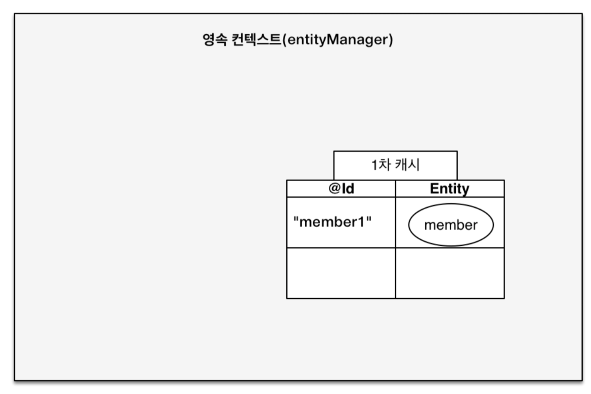
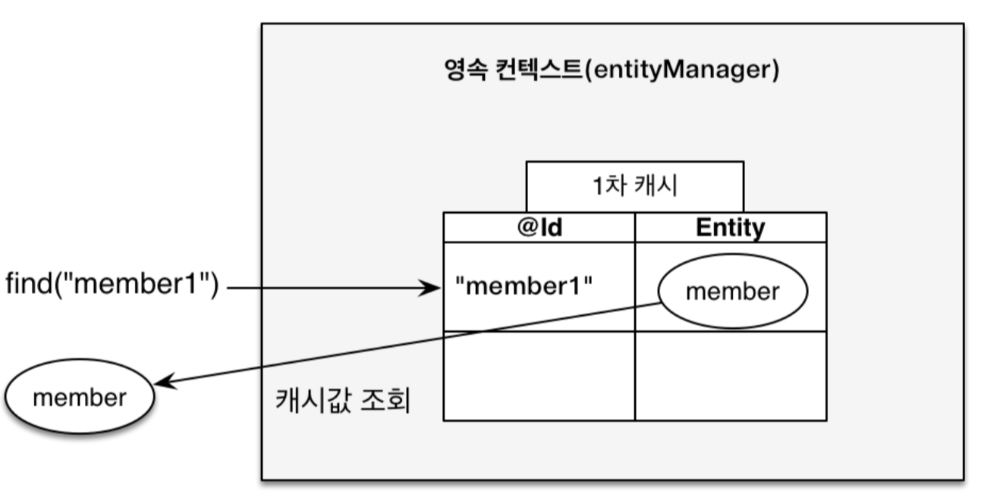
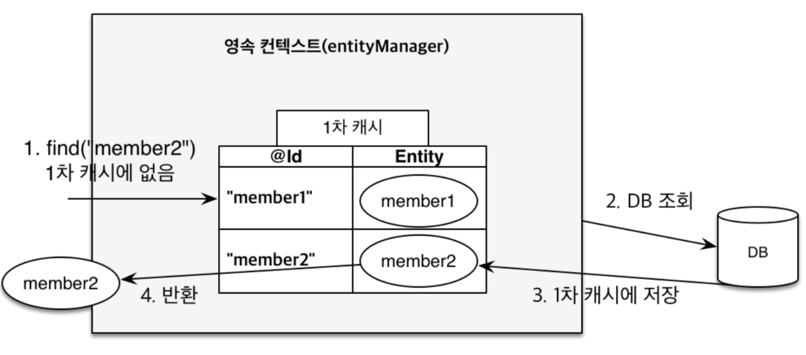

# JPA Hands-on

> 출처 : [JPA Hands-on Part 1 ~ 2](https://edu.nextstep.camp/s/ffeVDScX/ls/bOe1zSTF)

## 1.1. Part 1 - 들어가기 전에

### 1.1.1. 마음 한편에는...

- 네카라배는 JPA를 쓴다더라
- 객체 그래프를 못 그려? 간접 참조?
- A가 삭제되면 `FUN하고 COOL하고 SEXY`하게 A'도 삭제해 주세요.

### 1.1.2. Spring Data JDBC

- If you load an entity, SQL statements get executed. Once this is done, you have a completely loaded entity. No lazy loading or caching is done.
- If you save an entity, it gets saved. If you do not, it does not. There is no dirty tracking and no session.
- There is a simple model of how to map entities to tables. It probably only works for rather simple cases. If you do not like that, you should code your own strategy. Spring Data JDBC offers only very limited support for customizing the strategy with annotations.

> ?: 난 다 되는데?

### 1.1.3. 학습 로드맵

- [토크ON 41차. JPA 프로그래밍 기본기 다지기 | T아카데미](https://www.youtube.com/playlist?list=PL9mhQYIlKEhfpMVndI23RwWTL9-VL-B7U)
- [자바 ORM 표준 JPA 프로그래밍 (김영한 저 | 에이콘출판사)](http://www.yes24.com/Product/Goods/19040233)
- [인프런 - 김영한](https://www.inflearn.com/courses?s=%EA%B9%80%EC%98%81%ED%95%9C)
- [영속성 컨텍스트로 보는 JPA](https://www.slideshare.net/ssusere4d67c/jpa-56081624)

## 1.2. 태초에

### 1.2.1. 객체 지향 패러다임

- 시스템을 구성하는 객체들에게 적절한 책임을 할당하는 것
- 상속
- 연관 관계
   - 객체의 연관관계에는 방향성이 있다.
   - 테이블의 연관관계는 방향성이 없다.
- 객체는 자유롭게 객체 그래프를 탐색할 수 있어야 한다.

```java
class Line {
    Long id;
    String name;
    Set<LineStation> stations;
}

class LineStation {
    Station preStation;
    Station station;
}

class Station {
    Long id;
    String name;
}
```

### 1.2.2. SQL을 직접 다룰 때 발생하는 문제점

- 반복 작업
   - 새로운 필드가 추가되면 관련된 SQL을 다 수정해야 한다.

```java
class Station {
    Long id;
    String name;
}
```

```SQL
INSERT INTO station(`id`, `name`) VALUES ...
SELECT `id`, `name` FROM station
UPDATE station SET ...
```

- 신뢰성
   - 개발자들이 엔티티를 신뢰하고 사용할 수 없다.

```java
class LineService {
    private LineRepository lines;
    
    public class LineService(LineRepository lines) {
        this.lines = lines;
    }
    
    public void findLineWithStationsById(Long id) {
        Line line = lines.findById(id);
        line.getLineStation()
                .stream()
                .map(LineStation::getStation)
                .collect(Collectors.toList()); // ?
    }
}
```

## 1.3. JPA

### 1.3.1. ORM

[ORM vs SQL Mapper vs JDBC - 코즈](https://youtu.be/mezbxKGu68Y)

### 1.3.2. 데이터베이스 스키마 자동 생성

- `schema.sql` ?
- JPA는 데이터베이스 스키마를 자동으로 생성하는 기능을 지원한다.
- 아래 속성을 추가하면 애플리케이션 실행 시점에 데이터베이스 테이블을 자동으로 생성한다.
  - `spring.jpa.hibernate.ddl-auto = create`
  
```
create: 기존 테이블 삭제 후 다시 생성 (DROP + CREATE)
create-drop: create와 같으나 종료시점에 테이블 DROP
update: 변경된 부분만 반영 (운영 DB에 사용하면 안됌)
validate: entity와 table이 정상 매핑되었는지만 확인
none: 사용하지 않음
```

```java
@Entity // (1)
@Table(name = "station") // (2)
public class Station {
    @Id // (3)
    @GeneratedValue(strategy = GenerationType.IDENTITY) // (4)
    private Long id;

    @Column(name = "name", nullable = false) // (5)
    private String name;
    
    protected Station() { // (6)
    }
}
```

1. `@Entity`
   - 엔티티 클래스임을 지정하며 테이블과 매핑된다.
2. `@Table`
   - 엔티티가 매핑될 테이블을 지정하고 생략 시 엔티티 클래스 이름과 같은 테이블로 매핑된다.
   - 굳이 선언하지 않아도 된다.
3. `@Id`
   - 직접 매핑해서 사용하는 경우
4. `@GeneratedValue`
   - PK의 생성 규칙을 나타낸다.
5. `@Column`
   - 컬럼의 이름을 이용하여 지정된 필드나 속성을 테이블의 컬럼에 매핑한다.
   - 굳이 선언하지 않아도 된다.
6. 매개 변수가 없는 생성자
    - The entity class must have a no-arg constructor. The entity class may have other constructors as well. - JSR 338
    
### 1.3.3. 실습    
- `spring.jpa.properties.hibernate.format_sql=true`와 `spring.jpa.show-sql=true`를 추가하여 콘솔에 실행되는 테이블 생성 DDL을 출력해 보자.
```sql
create table station (
  id bigint generated by default as identity,
  name varchar(255) not null,
  primary key (id)
)
```

## 1.4. Spring Data JPA

### 1.4.1. Spring Data JPA를 쓰기 전

- 또 다시 반복 작업
```java
class StationRepository {
    void save(Station station) {...}
    Station findById(Long id) {...}
    List<Station> findAll() {...}
    Station findByName(String name) {...}
}
```

### 1.4.2. Spring Data JPA

```java
interface StationRepository extends JpaRepository<Station, String> {
    Station findByName(String name); // (1)
}
```

1. 메서드 이름으로 쿼리 생성
   - [Appendix C: Repository query keywords](https://docs.spring.io/spring-data/jpa/docs/current/reference/html/#repository-query-keywords)

### 1.4.3. 실습

- `save()`와 `findByName()`에 대한 테스트를 해 보자.

```java
@DataJpaTest
class StationRepositoryTest {
    @Autowired
    private StationRepository stations;
    
    @Test
    void save() {
        Station expected = new Station("잠실역");
        Station actual = stations.save(expected);
        assertAll(
                () -> assertThat(actual.getId()).isNotNull(),
                () -> assertThat(actual.getName()).isEqualTo(expected.getName())
        );
    }

    @Test
    void findByName() {
        String expected = "잠실역";
        stations.save(new Station(expected));
        String actual = stations.findByName(expected).getName();
        assertThat(actual).isEqualTo(expected);
    }
}
```

## 1.5. 영속성 컨텍스트

- 엔티티를 영구 저장하는 환경
- 엔티티 매니저로 엔티티를 저장하거나 조회하면 엔티티 매니저는 영속성 컨텍스트에 엔티티를 보관하고 관리한다.

> - 1차 캐시
> - 동일성 보장
> - 트랜잭션을 지원하는 쓰기 지연
> - 변경 감지
> - 지연 로딩

### 1.5.1. 실습

- 동일성 보장 맛보기

```java
@Test
void identity() {
    Station station1 = stations.save(new Station("잠실역"));
    Station station2 = stations.findById(station1.getId()).get();
    assertThat(station1 == station2).isTrue();
}
```





### 1.5.2. 엔티티의 생명주기

- 비영속(new/transient): 영속성 컨텍스트와 전혀 관계가 없는 상태
- 영속(managed): 영속성 컨텍스트에 저장된 상태
- 준영속(detached): 영속성 컨텍스트에 저장되었다가 분리된 상태
- 삭제(removed): 삭제된 상태


### 1.5.3. @Transactional

- 트랜잭션을 커밋하는 순간 영속성 컨텍스트를 데이터베이스에 반영


### 1.5.4. 실습

- 변경 감지 맛보기

```java
@Test
void update() {
    Station station1 = stations.save(new Station("잠실역"));
    station1.changeName("몽촌토성역");
    Station station2 = stations.findByName("몽촌토성역");
    assertThat(station2).isNotNull();
}
```


## 1.6. Part 2 - 들어가기 전에

- 객체는 파스칼 표기법을 따른다.
   - `Line`, `Station`, `Member`, `Favorite`, `LineStation`
- 테이블은 스네이크 표기법을 따른다.
   - `line`, `station`, `member`, `favorite`, `line_station`
   
## 1.7. 연관 관계

- 엔티티들은 대부분 다른 엔티티와 연관 관계가 있다.
- 객체는 참조(주소)를 사용해서 관계를 맺고 테이블은 외래 키를 사용해서 관계를 맺는다.

### 1.7.1. 핵심 키워드

- 방향: 단방향, 양방향이 있다.방향은 객체 관계에만 존재하고 테이블 관계는 항상 양방향이다.
- 다중성: 다대일(N:1), 일대다(1:N), 일대일(1:1), 다대다(N:M)
- 연관 관계의 주인: 객체를 양방향 연관 관계로 만들면 연관 관계의 주인을 정해야 한다.

### 1.7.2. 다대일, 일대다 연관 관계

- 역과 노선이 있다.
- 지하철역은 하나의 노선에만 소속될 수 있다.
   - 환승역은 고려하지 않는다.
- 지하철역과 노선은 다대일(N:1) 관계다.
- 노선과 지하철역은 일대다(1:N) 관계다.

```java
class Line {
    Long id;
    String name;
}

class Station {
    Long id;
    String name;
}
```

### 1.7.3. 다대일 단방향 연관 관계

```java
@Entity
@Table(name = "line")
public class Line {
    @Id
    @GeneratedValue(strategy = GenerationType.IDENTITY)
    private Long id;
    
    @Column(nullable = false)
    private String name;
    
    ...

}
```

```java
@Entity
@Table(name = "station")
public class Station {
    @Id
    @GeneratedValue(strategy = GenerationType.IDENTITY)
    private Long id;

    @Column(nullable = false)
    private String name;
    
    @ManyToOne // (1)
    @JoinColumn(name = "line_id") // (2)
    private Line line; // (3)
    
    public void setLine(final Line line) { // (4)
        this.line = line;
    }
    
    ...

}
```

1. `@ManyToOne`
   - 다대일(N:1) 관계라는 매핑 정보
2. `@JoinColumn`
   - 컬럼 이름과 외래 키가 참조할 컬럼을 직접 지정하지 않는다면 굳이 선언하지 않아도 된다.
3. 지하철역 객체는 `line` 필드로 노선 객체와 연관 관계를 맺는다.
   - `Station` -> `Line`: 가능
   - `Line` -> `Station`: 불가능
   - `station` -> `line`: 가능
   - `line` -> `station`: 가능
   - 지하철역과 노선은 단방향 관계다.
4. 연관 관계를 설정하는 메서드

#### 1.7.3.1. 실습

- 콘솔에 실행되는 테이블 생성 DDL을 출력해 보자.

```sql
create table line (
    id bigint generated by default as identity,
    name varchar(255) not null,
    primary key (id)
)

create table station (
    id bigint generated by default as identity,
    name varchar(255) not null,
    line_id bigint,
    primary key (id)
)

alter table station 
    add constraint FKklalypfiiahjy57wtapf4w92 
    foreign key (line_id) 
    references line
```

#### 1.7.3.2. 실습

- 연관 관계를 설정한 후 저장에 대한 테스트를 해 보자.

```java
@Test
void saveWithLine() {
    Station expected = new Station("잠실역");
    expected.setLine(new Line("2호선"));
    Station actual = stations.save(expected);
    stations.flush(); // transaction commit
}
```

```sql
insert 
into
    station
    (id, line_id, name) 
values
    (null, null, '잠실역')
```

> :exclamation: JPA에서 엔티티를 저장할 때 연관된 모든 엔티티는 영속 상태여야 한다.

```java
@Test
void saveWithLine() {
    Station expected = new Station("잠실역");
    expected.setLine(lines.save(new Line("2호선")));
    Station actual = stations.save(expected);
    stations.flush(); // transaction commit
}
```

```sql
insert 
into
    line
    (id, name) 
values
    (null, '2호선')
    
insert 
into
    station
    (id, line_id, name) 
values
    (null, 1, '잠실역')
```

#### 1.7.3.3. 실습

- 조회에 대한 테스트를 해 보자.
- `data.sql`

```sql
INSERT INTO line (id, name) VALUES (1, '3호선')
INSERT INTO station (id, line_id, name) VALUES (1, 1, '교대역')
```

```java
@Test
void findByNameWithLine() {
    Station actual = stations.findByName("교대역");
    assertThat(actual).isNotNull();
    assertThat(actual.getLine().getName()).isEqualTo("3호선");
}
```

```sql
select
    station0_.id as id1_1_,
    station0_.line_id as line_id3_1_,
    station0_.name as name2_1_ 
from
    station station0_ 
where
    station0_.name='교대역'
    
select
    line0_.id as id1_0_0_,
    line0_.name as name2_0_0_ 
from
    line line0_ 
where
    line0_.id=1
```

#### 1.7.3.4. 실습

- 수정에 대한 테스트를 해보자.

```java
@Test
void updateWithLine() {
    Station expected = stations.findByName("교대역");
    expected.setLine(lines.save(new Line("2호선")));
    stations.flush(); // transaction commit
}
```

```sql
update
    station 
set
    line_id=2,
    name='교대역'
where
    id=1
```

#### 1.7.3.5. 실습

- 연관 관계 제거에 대한 테스트를 해보자.

```java
@Test
void removeLine() {
    Station expected = stations.findByName("교대역");
    expected.setLine(null);
    stations.flush(); // transaction commit
}
```

```sql
update
    station 
set
    line_id=null,
    name='교대역'
where
    id=1
```

> :exclamation: 노선을 삭제하려면 기존에 있던 연관 관계를 먼저 제거하고 삭제해야 한다.

### 1.7.4. 양방향 연관 관계

- 반대 방향으로 객체 그래프 탐색이 가능하다.

```java
@Entity
@Table(name = "line")
public class Line {
    @Id
    @GeneratedValue(strategy = GenerationType.IDENTITY)
    private Long id;
    
    @Column(nullable = false)
    private String name;

    @OneToMany(mappedBy = "line") // (1)
    private List<Station> stations = new ArrayList<>(); // (2)
    
    ...

}
```

1. `@OneToMany`
   - 일대다(1:N) 관계라는 매핑 정보
   - `mappedBy` 속성은 연관 관계 주인의 필드 이름
2. 노선 객체는 `stations` 필드로 지하철역 객체와 연관 관계를 맺는다.
   - `Station` -> `Line`: 가능
   - `Line` -> `Station`: 가능
   - `station` -> `line`: 가능
   - `line` -> `station`: 가능
   - **지하철역과 노선은 양방향 관계다.**
   
#### 1.7.4.1. 실습

- 조회에 대한 테스트를 해보자.

```java
@Test
void findById() {
    Line line = lines.findByName("3호선");
    assertThat(line.getStations()).hasSize(1);
}
```

```sql
select
    line0_.id as id1_0_,
    line0_.name as name2_0_ 
from
    line line0_ 
where
    line0_.name='3호선'

select
    stations0_.line_id as line_id3_1_0_,
    stations0_.id as id1_1_0_,
    stations0_.id as id1_1_1_,
    stations0_.line_id as line_id3_1_1_,
    stations0_.name as name2_1_1_ 
from
    station stations0_ 
where
    stations0_.line_id=1
```

### 1.7.5. 연관 관계의 주인

- 엄밀히 이야기하면 객체에는 양방향 연관 관계라는 것이 없다.
- 서로 다른 단방향 연관 관계 2개를 양방향인 것처럼 보이게 할 뿐이다.
   - 지하철역과 노선은 다대일(N:1) 관계다.
   - 노선과 지하철역은 일대다(1:N) 관계다.
- 연관 관계의 주인만이 데이터베이스 연관 관계와 매핑되고 외래 키를 등록, 수정, 삭제할 수 있다.
- 주인이 아닌 쪽은 읽기만 할 수 있다.

> :exclamation: 연관 관계의 주인을 정한다는 것은 외래 키 관리자를 선택하는 것이다. 비즈니스 중요도로 접근하면 안 된다.

> :exclamation: 데이터베이스 테이블의 다대일, 일대다 관계에서는 항상 다 쪽이 외래 키를 가진다.

#### 1.7.5.1. 실습

- 저장에 대한 테스트를 해보자.

```java
@Test
void save() {
    Line expected = new Line("2호선");
    expected.addStation(new Station("잠실역"));
    lines.save(expected);
    lines.flush(); // transaction commit
}
```

```sql
insert 
into
    line
    (id, name) 
values
    (null, '2호선')
```

```java
@Test
void save() {
    Line expected = new Line("2호선");
    expected.addStation(stations.save(new Station("잠실역")));
    lines.save(expected);
    lines.flush(); // transaction commit
}
```

```sql
insert 
into
    station
    (id, line_id, name) 
values
    (null, null, '잠실역')

insert 
into
    line
    (id, name) 
values
    (null, '2호선')
```

> 

### 1.7.6. 연관 관계 편의 메서드

- 양방향 연관 관계는 결국 양쪽 다 신경 써야 한다.

```java
station.setLine(line);
line.addStation(station);
```

- 양방향 관계에서 두 코드는 하나인 것처럼 사용하는 것이 안전하다.
- 한 번에 양방향 관계를 설정하는 메서드를 **연관 관계 편의 메서드** 라 한다.

```java
public void setLine(Line line) {
    this.line = line;
    line.getStations().add(this);
}
```

```java
public void addStation(Station station) {
    stations.add(station);
    station.setLine(this);
}
```

> :exclamation: 양방향 매핑 시에는 무한 루프에 빠지지 않게 조심해야 한다.

### 1.7.7. 연관 관계 편의 메서드 작성 시 주의 사항

```java
station.setLine(line1);
station.setLine(line2);
boolean contains = line1.getStations().contains(station); // true
```

```java
@Entity
public class Favorite {
    @Id
    @GeneratedValue(strategy = GenerationType.IDENTITY)
    private Long id;

    protected Favorite() {
    }
}
```

```java
@Entity
public class Member {
    @Id
    @GeneratedValue(strategy = GenerationType.IDENTITY)
    private Long id;
    private String name;

    @OneToMany // (1)
    @JoinColumn(name = "member_id") // (2)
    private List<Favorite> favorites = new ArrayList<>(); // (3)

    ...
}
```

1. `@OneToMany`
   - 일대다(1:N) 관계라는 매핑 정보
2. `@JoinColumn`
   - `favorite`의 외래 키
3. 사용자 객체는 `favorites` 필드로 지하철역 객체와 연관 관계를 맺는다.
   - `Member` -> `Favorite`: 가능
   - `Favorite` -> `Member`: 불가능
   - `member` -> `favorite`: 가능
   - `favorite` -> `member`: 가능
   - **사용자와 즐겨찾기는 단방향 관계다.**

#### 1.7.7.1. 실습

- 콘솔에 실행되는 테이블 생성 DDL을 출력해 보자.

```sql
create table favorite (
    id bigint generated by default as identity,
    member_id bigint,
    primary key (id)
)

create table member (
    id bigint generated by default as identity,
    name varchar(255),
    primary key (id)
)

alter table favorite 
   add constraint FK5w3q9ljpthkixo71hetx3ired 
   foreign key (member_id) 
   references member
```

#### 1.7.7.2. 실습

- 저장에 대한 테스트를 해 보자.

```java
@Test
void save() {
    Member expected = new Member("jason");
    expected.addFavorite(favorites.save(new Favorite()));
    Member actual = members.save(expected);
    members.flush(); // transaction commit
}
```

```sql
insert 
into
    favorite
    (id) 
values
    (null)

insert 
into
    member
    (id, name) 
values
    (null, 'jason')

update
    favorite 
set
    member_id=1 
where
    id=1
```

### 1.7.8. 일대다 단방향 매핑의 단점

- 매핑한 객체가 관리하는 외래 키가 다른 테이블에 있다.
- 연관 관계 처리를 위한 UPDATE SQL을 추가로 실행해야 한다.
- 일대다 단방향 매핑보다는 다대일 양방향 매핑을 권장한다.

### 1.7.9. 일대일 연관 관계
- 일대일 관계는 그 반대도 일대일 관계다.
- 일대일 관계는 주 테이블이나 대상 테이블 둘 중 어느 곳이나 외래 키를 가질 수 있기 때문에 **외래 키를 어느 곳에 두어야 하는지 고민을 해야 한다.**
   - `station`이 주 테이블이고 `line_station`이 대상 테이블이라고 가정한다.

```java
class Station {
    Long id;
    String name;
    LineStation lineStation;
}

class LineStation {
    Long id;
}
```

### 1.7.10. 주 테이블에 외래 키

- 주 테이블이 외래 키를 가지고 있으므로 주 테이블만 확인해도 대상 테이블과 연관 관계가 있는지 알 수 있다.
   - Station -> LineStation: 가능
   
#### 1.7.10.1. 단방향 연관 관계

```java
@Entity
@Table(name = "line_station")
public class LineStation {
    @Id
    @GeneratedValue(strategy = GenerationType.IDENTITY)
    private Long id;

    @ManyToOne
    @JoinColumn(name = "line_id")
    private Line line;
    
    ...

}
```

```java
@Entity
@Table(name = "station")
public class Station {
    @Id
    @GeneratedValue(strategy = GenerationType.IDENTITY)
    private Long id;

    @Column(name = "name", nullable = false)
    private String name;

    @OneToOne // (1)
    @JoinColumn(name = "line_station_id") // (2)
    private LineStation lineStation; // (3)
    
    ...

}
```

1. `@OneToOne`
   - 일대일(1:1) 관계라는 매핑 정보
2. `@JoinColumn`
   - 컬럼 이름과 외래 키가 참조할 컬럼을 직접 지정하지 않는다면 굳이 선언하지 않아도 된다.
3. 지하철역 객체는 `lineStation` 필드로 노선의 지하철역 객체와 연관 관계를 맺는다.
   - `Station` -> `LineStation`: 가능
   - `LineStation` -> `Station`: 불가능
   - `station` -> `line_station`: 가능
   - `liline_stationne` -> `station`: 가능

##### 1.7.10.1.1. 실습

- 콘솔에 실행되는 테이블 생성 DDL을 출력해보자.

```sql
create table line_station (
    id bigint generated by default as identity,
    line_id bigint,
    primary key (id)
)

create table station (
    id bigint generated by default as identity,
    name varchar(255) not null,
    line_station_id bigint,
    primary key (id)
)

alter table station 
   add constraint FKtkxivxas996j9c54ngcd0bby2 
   foreign key (line_station_id) 
   references line_station
```

##### 1.7.10.1.2. 실습

- 저장에 대한 테스트를 해보자.

```java
@Test
void saveWithLineStation() {
    LineStation lineStation = lineStations.save(new LineStation());
    stations.save(new Station("잠실역", lineStation));
}
```

```sql
insert 
into
    line_station
    (id, line_id) 
values
    (null, 1)

insert 
into
    station
    (id, line_station_id, name) 
values
    (null, 1, '잠실역')

```

#### 1.7.10.2. 양방향 연관 관계

```java
@Entity
@Table(name = "line_station")
public class LineStation {
    @Id
    @GeneratedValue(strategy = GenerationType.IDENTITY)
    private Long id;

    @ManyToOne
    @JoinColumn(name = "line_id")
    private Line line;
    
    @OneToOne(mappedBy = "lineStation") // (1)
    private Station station; // (2)
    
    ...
}
``` 

1. `@OneToOne`
   - 일대일(1:1) 관계라는 매핑 정보
   - `mappedBy` 속성은 연관 관계 주인의 필드 이름
2. 노선의 지하철역 객체는 `station` 필드로 지하철역 객체와 연관 관계를 맺는다.
   - `Station` -> `LineStation`: 가능
   - `LineStation` -> `Station`: 가능
   - `station` -> `line_station`: 가능
   - `line_station` -> `station`: 가능
   
### 1.7.11. 대상 테이블에 외래 키

- 테이블 관계를 일대일에서 일대다로 변경할 때 테이블 구조를 그대로 유지할 수 있다.
   - **환승역을 고려해 본다.**

#### 1.7.11.1. 단방향 연관 관계

- **이런 모양으로 매핑할 수 있는 방법이 없다.**
   - `Station` -> `LineStation`: 불가능
   - `LineStation` -> `Station`: 불가능

#### 1.7.11.2. 양방향 연관 관계

```java
@Entity
@Table(name = "line_station")
public class LineStation {
    @Id
    @GeneratedValue(strategy = GenerationType.IDENTITY)
    private Long id;

    @ManyToOne
    @JoinColumn(name = "line_id")
    private Line line;
    
    @OneToOne
    @JoinColumn(name = "station_id")
    private Station station;
    
    ...

}
```

```java
@Entity
@Table(name = "station")
public class Station {
    @Id
    @GeneratedValue(strategy = GenerationType.IDENTITY)
    private Long id;

    @Column(name = "name", nullable = false)
    private String name;

    @OneToOne(mappedBy = "station")
    private LineStation lineStation;
    
    ...

}
```

##### 1.7.11.2.1. 실습

- 콘솔에 실행되는 테이블 생성 DDL을 출력해보자.

```sql
create table line_station (
    id bigint generated by default as identity,
    line_id bigint,
    station_id bigint,
    primary key (id)
)

create table station (
    id bigint generated by default as identity,
    name varchar(255) not null,
    primary key (id)
)

alter table line_station 
    add constraint FK78y8i0a0kum6n7s2qss4wi6i9 
    foreign key (station_id) 
    references station
```

### 1.7.12. 다대다 연관 관계

- 관계형 데이터베이스는 정규화된 테이블 2개로 다대다 관계를 표현할 수 없다.
- 보통 다대다 관계를 일대다, 다대일 관계로 풀어내는 연결 테이블을 사용한다.
- **연결 테이블에 필드가 추가되면 더는 사용할 수 없다.**

### 1.8. 더 하고 싶은 말

- 지연 로딩
- CASCADE
- 고아 객체
