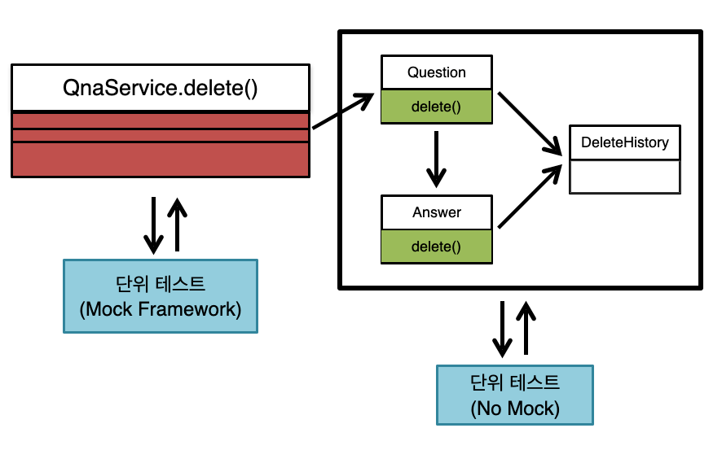

## 1단계 - 엔티티 매핑

### 요구사항

* QnA 서비스를 만들어 가면서 JPA로 도메인 모델 구성, 객체 테이블 매핑 방법에 대해 학습한다
    * 제시 된 DDL을 보고 엔티티 클래스와 레포지토리 클래스를 작성해본다
        * **answer**
          ```
          create table answer
          (
          id          bigint generated by default as identity,
          contents    clob,
          created_at  timestamp not null,
          deleted     boolean   not null,
          question_id bigint,
          updated_at  timestamp,
          writer_id   bigint,
          primary key (id)
          )

        * **delete_history**
          ```
          create table delete_history
          (
          id            bigint generated by default as identity,
          content_id    bigint,
          content_type  varchar(255),
          create_date   timestamp,
          deleted_by_id bigint,
          primary key (id)
          )

        * **question**
          ```
          create table question
          (
              id         bigint generated by default as identity,
              contents   clob,
              created_at timestamp    not null,
              deleted    boolean      not null,
              title      varchar(100) not null,
              updated_at timestamp,
              writer_id  bigint,
              primary key (id)
          )
        * **user**
           ```
           create table user
           (
               id         bigint generated by default as identity,
               created_at timestamp   not null,
               email      varchar(50),
               name       varchar(20) not null,
               password   varchar(20) not null,
               updated_at timestamp,
               user_id    varchar(20) not null,
               primary key (id)
           )
               
           alter table user
               add constraint UK_a3imlf41l37utmxiquukk8ajc unique (user_id)

    * ```@DataJpaTest```를 사용하여 학습 테스트를 진행한다
        * CRUD 기능 테스트 수행

### 힌트

[Auto-configured Data JPA Tests](https://docs.spring.io/spring-boot/docs/current/reference/htmlsingle/#features.testing.spring-boot-applications.autoconfigured-spring-data-jpa)

Spring Data JPA 사용 시 아래 옵션은 동작 쿼리를 로그로 확인할 수 있게 해준다

```
spring.jpa.properties.hibernate.format_sql=true
spring.jpa.show-sql=true
```

MySQL Dialect

```
spring.datasource.url=jdbc:h2:~/test;MODE=MySQL
spring.jpa.properties.hibernate.dialect=org.hibernate.dialect.MySQL57Dialect
```

```
create table answer
(
    id          bigint not null auto_increment,
    contents    longtext,
    created_at  datetime(6) not null,
    deleted     bit    not null,
    question_id bigint,
    updated_at  datetime(6),
    writer_id   bigint,
    primary key (id)
) engine=InnoDB

create table delete_history
(
    id            bigint not null auto_increment,
    content_id    bigint,
    content_type  varchar(255),
    create_date   datetime(6),
    deleted_by_id bigint,
    primary key (id)
) engine=InnoDB

create table question
(
    id         bigint       not null auto_increment,
    contents   longtext,
    created_at datetime(6)  not null,
    deleted    bit          not null,
    title      varchar(100) not null,
    updated_at datetime(6),
    writer_id  bigint,
    primary key (id)
) engine=InnoDB

create table user
(
    id         bigint      not null auto_increment,
    created_at datetime(6) not null,
    email      varchar(50),
    name       varchar(20) not null,
    password   varchar(20) not null,
    updated_at datetime(6),
    user_id    varchar(20) not null,
    primary key (id)
) engine=InnoDB

alter table user
    add constraint UK_a3imlf41l37utmxiquukk8ajc unique (user_id)
```

## 2단계 - 연관 관계 매핑

### 요구사항

* 객체의 참조와 테이블의 외래 키를 매핑해서 객체에서는 참조를 사용하고 테이블에서는 외래 키를 사용할 수 있도록 한다

### 힌트

* **객체 설계를 테이블 설계에 맞춘 방식**

```
Question question = findQuestionById(questionId);
List<Answer> answers = answerRepository.findByQuestionIdAndDeletedFalse(questionId);
```

* **관계형 데이터베이스의 외래키 조인 방식**

```
Question question = findQuestionById(questionId);
List<Answer> answers = question.getAnswers();
```

### 구현 사항 DDL

* **H2**

```
alter table answer
    add constraint fk_answer_to_question
        foreign key (question_id)
            references question

alter table answer
    add constraint fk_answer_writer
        foreign key (writer_id)
            references user

alter table delete_history
    add constraint fk_delete_history_to_user
        foreign key (deleted_by_id)
            references user

alter table question
    add constraint fk_question_writer
        foreign key (writer_id)
            references user
```

* **MySql**

```
alter table answer
    add constraint fk_answer_to_question
        foreign key (question_id)
            references question (id)

alter table answer
    add constraint fk_answer_writer
        foreign key (writer_id)
            references user (id)

alter table delete_history
    add constraint fk_delete_history_to_user
        foreign key (deleted_by_id)
            references user (id)

alter table question
    add constraint fk_question_writer
        foreign key (writer_id)
            references user (id)
```

* 참조 관계 정리
    * `answer` 테이블은 `question_id` 필드로 `question` 테이블과 관계를 맺는다
        * `하나의 question`에는 `여러개의 answer`가 발생할 수 있다
    * `answer` 테이블은 `writer_id` 필드로 `user` 테이블과 관계를 맺는다
        * `하나의 user`는 `여러개의 answer`를 작성할 수 있다
    * `delete_history` 테이블은 `deleted_by_id` 필드로 `user` 테이블과 관계를 맺는다
        * `하나의 user`는 `여러 개의 삭제 히스토리`를 가질 수 있다
    * `question` 테이블은 `writer_id` 필드로 `user` 테이블과 관계를 맺는다
        * `하나의 user`는 `여러 개의 question`을 작성할 수 있다

## 3단계 - 질문 삭제하기 리펙터링

### 기능 요구사항

* `질문` 데이터는 `soft delete` 한다. (deleted 컬럼 활용)
* `로그인 사용자 = 질문자` 인 경우에 `삭제 가능`하다
* `답변`이 없는 경우에 `삭제 가능` 하다
* `질문자 = 모든 답변자` 인 경우에 `삭제 가능`하다
* `질문이 삭제` 될 때 `답변도 삭제` 되어야 한다. (deleted 컬럼 활용)
* `질문자 != 답변자`인 경우 `삭제 불가능` 하다
* `질문과 답변 삭제 이력` 에 대한 정보를 `DeleteHistory`를 통해 남긴다


* **질문 삭제가 가능한 경우**
    * `로그인 사용자 = 질문자`
    * `답변`이 없는 경우
    * `질문자 = 모든 답변자` 인 경우
* **질문 삭제가 불가능한 경우**
    * `질문자 != 답변자`인 경우

### 프로그래밍 요구 사항

* 리펙터링 이후에도 `QnaServiceTest` 의 모든 테스트가 통과해야 한다
* `코드 컨벤션`을 지킨다
* `indent는 2`를 넘지 않도록 한다
* `3항 연산자`를 사용하지 않는다
* `else`, `switch/case` 사용하지 않는다
* `모든 기능`을 TDD로 구현해 `단위 테스트`가 존재해야 한다
* 메서드의 길이는 `10라인을 넘지 않도록` 한다
* 배열 대신 `컬렉션`을 사용
* 모든 `원시 값과 문자열을 포장`한다
* 축약 금지
* `일급 컬렉션` 사용
* `모든 엔티티를 작게` 유지한다
* `3개 이상 인스턴스 변수를 가진 클래스를 사용하지 않는다`



